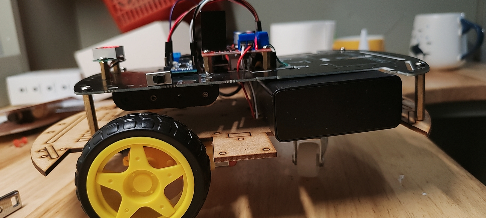

## 课程学习过程

在本课程中，我们经历了以下几个主要阶段：

1. **理论学习**：首先，我们学习了设计思维的基本概念和方法，包括共情、定义问题、原型设计和测试，同时学习了相关技术如esp32和前端技术。
2. **需求调研**：我们通过市场调研和用户访谈，深入了解了目标用户的需求和痛点。
3. **头脑风暴**：团队成员一起进行了头脑风暴，提出了各种可能的解决方案。
4. **原型设计**：根据头脑风暴的结果，我们设计了项目的初步原型。
5. **原型测试**：在实际用户中测试原型，收集反馈并进行改进。
6. **开发实物原型**：最终，我们开发出了项目的实物原型，并进行了展示和分享。

## 项目的用户和应用场景

### 用户

1. **户外探险爱好者**
2. **户外摄影爱好者**
3. **家庭主妇**
4. **学生**
5. **草原游牧民族**

### 应用场景

1. **远程监测牲畜**：小车配备摄像头，可以在用户外出时监测牧场上的牲畜，确保它们的安全。
2. **草原巡视**：用户可以通过小车的摄像头实时查看草原上的情况，包括天气变化、植被生长等，以便更好地安排放牧路线。
3. **紧急情况报警**：小车配备的温度和湿度检测器可以在出现火灾等紧急情况时发出警报，保障用户和家人的安全。
4. **供电储备**：小车的太阳能和风力发电装置可以为用户提供额外的电力储备，以备不时之需，比如为家用电器充电或提供照明。
5. **提供日常用品**：小车可以设计成一个移动式存储装置，装载一些日常生活用品，如食物、水、药品等，方便用户在草原上的生活。
6. **自动导航**：小车可以通过GPS等技术实现自动导航，用户只需设定目的地，小车就能自主规划最优路线前往，减轻用户的负担。
7. **环境监测**：小车配备的温度和湿度检测器可以实时监测气候状况，帮助用户选择合适的放牧地点和时间。
8. **追踪丢失物品**：用户在草原上放牧时，常常会遗失一些物品，小车配备的摄像头和传感器可以帮助用户快速找回丢失的物品。
9. **智能交流**：小车可以与用户的智能手机连接，通过手机App进行交流和控制，用户可以远程监控小车的状态并发送指令。
10. **生物识别**：小车配备的摄像头和生物识别技术可以帮助用户识别草原上的动物，提高放牧效率和安全性。

## 用户痛点

1. **环境监测不准确**：小车的温度和湿度检测器可能存在误差，导致监测结果不准确，影响火灾预警的有效性。

2. **通讯系统故障**：如果小车的通讯系统发生故障，可能会导致无法及时联系附近的村民，影响火灾预警的传达和应对。

3. **能源供应不足**：小车依赖能源来运行各种设备，如果能源供应不足或中断，可能会导致监测设备无法正常工作，影响火灾预警的及时性。

4. **监测设备损坏**：在极端环境下，小车上的监测设备可能会受到损坏，影响对周围环境的准确监测，从而降低火灾预警的可靠性。

5. **信息处理延迟**：如果小车的信息处理系统反应缓慢，可能会延迟对监测数据的分析和预警信息的发送，影响火灾预警的及时性。

6. **通讯信号不稳定**：在草原等边远地区，通讯信号可能不稳定，导致小车无法及时与外界通讯，影响火灾预警的有效性。

7. **应急资源不足**：如果小车携带的应急资源有限，可能会影响在火灾发生后的应对能力，增加灾害的风险。

8. **系统故障**：小车的各个系统可能会发生故障，如控制系统、电力系统等，影响小车的正常运行和火灾预警的执行。

9. **使用门槛高**：如果小车的操作复杂或需要专业知识，可能会增加村民使用的门槛，降低火灾预警的普及和实用性。

10. **依赖外部支持**：小车可能会依赖外部支持，如互联网连接或其他设备，这在偏远地区可能难以保证，影响其功能的正常发挥。

## 设计概念图

## 实物原型照片

### 小车

### 

### 控制器

